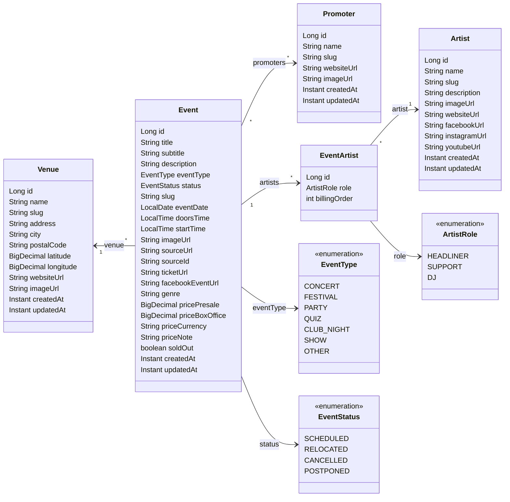

# Data Model

This document describes the domain model for the Event Checker application. The model is designed to capture music event
data from Berlin venue websites (e.g. [Astra Kulturhaus](https://www.astra-berlin.de/),
[Badehaus Berlin](https://badehaus-berlin.com/), [Cassiopeia](https://cassiopeia-berlin.de/),
[Privatclub](https://privatclub-berlin.de/), [Bi Nuu](https://binuu.de/),
[Festsaal Kreuzberg](https://festsaal-kreuzberg.de/de), [Lido](https://www.lido-berlin.de/),
[Urban Spree](https://www.urbanspree.com/), [Madame Claude](https://madameclaude.de/)).

## Class Diagram



Domain classes are organized by feature in `events-core`:

```
de.norm.events
├── artist/
│   └── Artist.kt
├── event/
│   └── Event.kt          (Event, EventType, EventStatus, EventArtist, ArtistRole)
├── promoter/
│   └── Promoter.kt
└── venue/
    └── Venue.kt
```

## Entities

### Venue

Represents a physical venue where music events take place (e.g. Astra Kulturhaus, Badehaus Berlin, SO36).

| Field         | Type           | Nullable | Description                 | Example                         |
|---------------|----------------|----------|-----------------------------|---------------------------------|
| `id`          | `BIGINT`       | No       | Auto-generated primary key  | `42`                            |
| `name`        | `TEXT`         | No       | Display name of the venue   | `Astra Kulturhaus`              |
| `slug`        | `TEXT` (UQ)    | No       | URL-friendly identifier     | `astra-kulturhaus`              |
| `address`     | `TEXT`         | Yes      | Street address              | `Revaler Str. 99`               |
| `city`        | `TEXT`         | No       | City (defaults to `Berlin`) | `Berlin`                        |
| `postal_code` | `TEXT`         | Yes      | Postal code                 | `10245`                         |
| `latitude`    | `DECIMAL(9,6)` | Yes      | Geographic latitude         | `52.507242`                     |
| `longitude`   | `DECIMAL(9,6)` | Yes      | Geographic longitude        | `13.451803`                     |
| `website_url` | `TEXT`         | Yes      | Venue's official website    | `https://www.astra-berlin.de`   |
| `image_url`   | `TEXT`         | Yes      | Venue logo or photo         | `https://example.com/astra.jpg` |
| `created_at`  | `TIMESTAMPTZ`  | No       | Record creation timestamp   |                                 |
| `updated_at`  | `TIMESTAMPTZ`  | No       | Last modification timestamp |                                 |

### Event

Core entity representing a single music event at a venue on a specific date.

| Field                | Type            | Nullable | Description                                                     | Example                                                    |
|----------------------|-----------------|----------|-----------------------------------------------------------------|------------------------------------------------------------|
| `id`                 | `BIGINT`        | No       | Auto-generated primary key                                      | `101`                                                      |
| `venue_id`           | `BIGINT` FK     | No       | References `venue.id`                                           | `42`                                                       |
| `title`              | `TEXT`          | No       | Event headline                                                  | `THE ADICTS`                                               |
| `subtitle`           | `TEXT`          | Yes      | Tour name or support acts line                                  | `„Adios Amigos Tour 2026" + Support: MAID OF ACE + KAOS`   |
| `description`        | `TEXT`          | Yes      | Longer description / artist bio                                 | `Formed in Ipswich in the late 1970s…`                     |
| `event_type`         | `TEXT`          | No       | Event category (see `EventType` enum)                           | `CONCERT`                                                  |
| `status`             | `TEXT`          | No       | Scheduling status (see `EventStatus` enum, default `SCHEDULED`) | `SCHEDULED`                                                |
| `slug`               | `TEXT`          | No       | URL-friendly identifier                                         | `2026-06-12-the-adicts`                                    |
| `event_date`         | `DATE`          | No       | Calendar date of the event                                      | `2026-06-12`                                               |
| `doors_time`         | `TIME`          | Yes      | When doors open                                                 | `19:00`                                                    |
| `start_time`         | `TIME`          | Yes      | When the show starts                                            | `20:00`                                                    |
| `image_url`          | `TEXT`          | Yes      | Event poster / flyer URL                                        | `https://example.com/adicts-poster.jpg`                    |
| `source_url`         | `TEXT`          | Yes      | Original URL on the venue website                               | `https://www.astra-berlin.de/events/2026-06-12-the-adicts` |
| `source_id`          | `TEXT` (UQ)     | No       | Unique import key for idempotent upserts                        | `astra:2026-06-12-the-adicts`                              |
| `ticket_url`         | `TEXT`          | Yes      | External ticket shop URL (eventim, dice, etc.)                  | `https://www.eventim.de/event/...`                         |
| `facebook_event_url` | `TEXT`          | Yes      | Direct link to the Facebook event page                          | `https://fb.me/e/60JFqXAUr`                                |
| `genre`              | `TEXT`          | Yes      | Music genre or style tag from the source venue                  | `Punk`                                                     |
| `price_presale`      | `DECIMAL(10,2)` | Yes      | Presale ticket price (Vorverkauf)                               | `38.00`                                                    |
| `price_box_office`   | `DECIMAL(10,2)` | Yes      | Box office ticket price (Abendkasse)                            | `45.00`                                                    |
| `price_currency`     | `TEXT`          | No       | ISO 4217 currency code (default EUR)                            | `EUR`                                                      |
| `price_note`         | `TEXT`          | Yes      | Free-form pricing info for non-standard pricing                 | `donation 2-5€`                                            |
| `sold_out`           | `BOOLEAN`       | No       | Whether all tickets are sold out                                | `false`                                                    |
| `created_at`         | `TIMESTAMPTZ`   | No       | Record creation timestamp                                       |                                                            |
| `updated_at`         | `TIMESTAMPTZ`   | No       | Last modification timestamp                                     |                                                            |

### Artist

Represents a musical artist or band. Normalized separately so artists can appear in multiple events.

| Field           | Type          | Nullable | Description                 | Example                                        |
|-----------------|---------------|----------|-----------------------------|------------------------------------------------|
| `id`            | `BIGINT`      | No       | Auto-generated primary key  | `7`                                            |
| `name`          | `TEXT`        | No       | Stage or band name          | `The Adicts`                                   |
| `slug`          | `TEXT` (UQ)   | No       | URL-friendly identifier     | `the-adicts`                                   |
| `description`   | `TEXT`        | Yes      | Artist biography            | `Formed in Ipswich in the late 1970s…`         |
| `image_url`     | `TEXT`        | Yes      | Photo or logo URL           | `https://example.com/adicts.jpg`               |
| `website_url`   | `TEXT`        | Yes      | Official homepage           | `https://theadicts.net/`                       |
| `facebook_url`  | `TEXT`        | Yes      | Facebook page URL           | `https://www.facebook.com/theadicts`           |
| `instagram_url` | `TEXT`        | Yes      | Instagram profile URL       | `https://www.instagram.com/theadictsofficial/` |
| `youtube_url`   | `TEXT`        | Yes      | YouTube channel URL         | `https://www.youtube.com/@theadictsofficial`   |
| `created_at`    | `TIMESTAMPTZ` | No       | Record creation timestamp   |                                                |
| `updated_at`    | `TIMESTAMPTZ` | No       | Last modification timestamp |                                                |

### Promoter

Represents an event promoter or presenter. Shared across events and venues.

| Field         | Type          | Nullable | Description                 | Example                                |
|---------------|---------------|----------|-----------------------------|----------------------------------------|
| `id`          | `BIGINT`      | No       | Auto-generated primary key  | `3`                                    |
| `name`        | `TEXT`        | No       | Promoter name               | `36 Concerts`                          |
| `slug`        | `TEXT` (UQ)   | No       | URL-friendly identifier     | `36-concerts`                          |
| `website_url` | `TEXT`        | Yes      | Website or social page      | `https://www.facebook.com/36Concerts/` |
| `image_url`   | `TEXT`        | Yes      | Logo image URL              | `https://example.com/36-concerts.jpg`  |
| `created_at`  | `TIMESTAMPTZ` | No       | Record creation timestamp   |                                        |
| `updated_at`  | `TIMESTAMPTZ` | No       | Last modification timestamp |                                        |

### EventArtist (Join Table)

Links events to artists with role and billing order to model the lineup.

| Field           | Type        | Nullable | Description                         | Example     |
|-----------------|-------------|----------|-------------------------------------|-------------|
| `id`            | `BIGINT`    | No       | Auto-generated primary key          | `12`        |
| `event_id`      | `BIGINT` FK | No       | References `event.id`               | `101`       |
| `artist_id`     | `BIGINT` FK | No       | References `artist.id`              | `7`         |
| `role`          | `TEXT`      | No       | `HEADLINER`, `SUPPORT`, or `DJ`     | `HEADLINER` |
| `billing_order` | `INT`       | No       | Position in lineup (0 = top-billed) | `0`         |

Unique constraint on `(event_id, artist_id)` prevents duplicate artist-event associations.

### EventPromoter (Join Table)

Links events to their promoters/presenters.

| Field         | Type        | Nullable | Description              | Example |
|---------------|-------------|----------|--------------------------|---------|
| `event_id`    | `BIGINT` FK | No       | References `event.id`    | `101`   |
| `promoter_id` | `BIGINT` FK | No       | References `promoter.id` | `3`     |

Composite primary key `(event_id, promoter_id)`.

## Design Decisions

### Idempotent Imports via `source_id`

Each event has a unique `source_id` (e.g. `astra:2026-06-12-the-adicts`) that identifies it from the import source.
This allows the importer to use upsert semantics: if an event with the same `source_id` already exists, it gets updated
rather than duplicated. This is critical for scheduled re-imports.

### Rich Domain Model in `events-core`

The Kotlin domain classes in `events-core` use embedded object references (e.g. `Event.venue: Venue`) rather than raw
foreign key IDs. This makes the domain model expressive and self-documenting. The persistence layer in `events-importer`
and `events-bff` maps between these domain objects and the flat relational schema.

### Separate `EventArtist` Join Entity

A dedicated join entity (rather than just a list of artist IDs on the event) captures:

- **Role** — whether the artist is a headliner, support act, or DJ
- **Billing order** — the position in the lineup (lower = higher on the bill)

This information is displayed prominently on venue websites and is important for the UI.

### Inline Price Fields Instead of Separate Table

Pricing is embedded directly on the `event` table as `price_presale`, `price_box_office`, `price_currency`, and
`price_note` rather than in a separate `event_price` table. This was chosen because:

- Berlin venue websites consistently show at most two price types: presale (Vorverkauf) and box office (Abendkasse)
- Some venues use non-standard pricing (e.g. "donation 2-5€") captured by `price_note`
- A 1:1 relationship between event and its price record adds unnecessary join overhead
- Nullable `DECIMAL` columns cleanly express "no price information available"
- Keeps queries simple — no joins needed to display event listings with prices

### External Ticket URL

The `ticket_url` field stores a link to the external ticket shop (eventim.de, ticketshop.live, vvk.link, dice.fm, etc.).
This is distinct from `source_url` (the venue's own event page). Nearly every event on Berlin venue websites links to
an external ticket provider, and this information is valuable for users.

### Event Status for Relocated/Cancelled Events

Berlin venues frequently update event listings to mark events as relocated ("VERLEGT"), cancelled, or postponed.
The `status` field captures this state so the frontend can display appropriate badges and the importer can update
events without losing the original record.

### `slug` Fields on All Main Entities

URL-friendly slugs are stored on venues, artists, promoters, and events. These are used for:

- Clean REST API URLs (e.g. `/venues/astra-kulturhaus`)
- Matching against source website URL patterns during import
- Human-readable identifiers in logs and debugging

### PostgreSQL-Specific Choices

- **`GENERATED ALWAYS AS IDENTITY`** for auto-incrementing IDs (SQL standard, preferred over `SERIAL`)
- **`TIMESTAMPTZ`** for all timestamps (timezone-aware, avoids surprises with UTC conversions)
- **`TEXT`** over `VARCHAR(n)` (PostgreSQL treats them identically; `TEXT` avoids arbitrary length limits)
- **`DECIMAL(10,2)`** for prices (exact arithmetic, no floating-point rounding)
- **`DECIMAL(9,6)`** for coordinates (6 decimal places ≈ ~11 cm precision)

## Flyway Migration

The database schema is managed by Flyway in `events-importer`:

```
events-importer/src/main/resources/db/migration/
└── V001__create_initial_schema.sql
```
