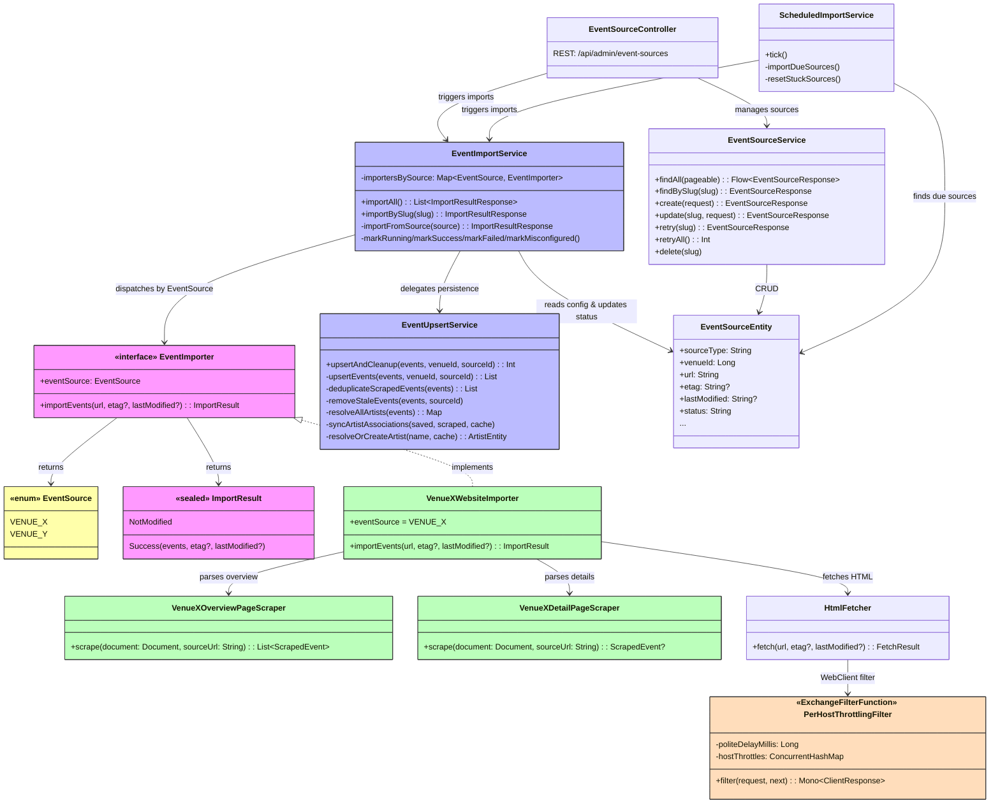

# ADR-007: Web Scraping Strategy

## Status

Accepted

## Context

The application needs to import music event data from ~40+ Berlin venue and promoter websites
(see [EVENT_DATA_SOURCES.md](../EVENT_DATA_SOURCES.md)). These websites vary widely in technology:

- **~80% are static/server-rendered HTML** — WordPress, PHP, Laravel, hand-coded HTML (e.g. Privatclub,
  Madame Claude, Supamolly, Junction Bar, Roadrunner's Paradise).
- **~15% are JavaScript-rendered SPAs** — Angular (Fluxbau), Nuxt.js (Festsaal Kreuzberg), Wix (Loge),
  or sites behind cookie walls (SO36).
- **A few offer structured feeds** — Supamolly has an RSS feed; Astra exposes `schema.org MusicEvent`
  JSON-LD markup.

Key requirements:

1. Non-blocking integration with the existing coroutine/WebFlux stack.
2. Reliable parsing of messy, real-world HTML (retro sites, malformed markup).
3. Conditional requests (ETag / Last-Modified) to avoid unnecessary re-scraping.
4. Extensible design — adding a new venue scraper should be straightforward.

## Decision

Use a **layered scraping strategy** with three tools, each covering a different tier of complexity:

### 1. Spring WebClient — HTTP Fetching (already in the project)

`spring-boot-starter-webclient` is already a dependency. Use it as the HTTP client for all scraping
requests instead of Jsoup's built-in `Jsoup.connect()`. This keeps HTTP fetching reactive and integrates
naturally with the coroutine stack via `awaitBody<String>()`.

WebClient also supports conditional requests out of the box — send `If-None-Match` (ETag) and
`If-Modified-Since` headers to detect whether a page has changed before downloading the full body.

### 2. Jsoup — HTML Parsing (new dependency)

**`org.jsoup:jsoup`** is the de-facto standard HTML parser on the JVM. It provides:

- A CSS selector API for extracting elements (similar to jQuery / `document.querySelector`).
- Robust handling of malformed HTML — critical for retro/hand-coded sites.
- `schema.org` JSON-LD extraction for sites like Astra that embed structured data.

Jsoup is used **only for parsing** (not HTTP fetching). Since `Jsoup.parse()` is a CPU-bound blocking
call, it is wrapped in `withContext(Dispatchers.IO)` to avoid blocking the coroutine event loop.

This covers ~80% of the target venues.

### 3. Playwright (future — not added yet)

For the ~5 venues that require JavaScript execution (Angular SPAs, cookie walls, JS-rendered content),
**Playwright for Java** (`com.microsoft.playwright:playwright`) is the recommended future addition.
It provides a modern headless browser API with Chromium/Firefox/WebKit support.

Playwright is **not added in this initial implementation** to keep the footprint minimal. It will be
introduced when the first JS-rendered venue is targeted for import.

### Architecture

A new `scraper` Spring Modulith module (`de.norm.events.scraper`) encapsulates all scraping
infrastructure:



Key components:

- **`EventSource`** — enum of known import sources (e.g. `CASSIOPEIA`), providing compile-time safe
  dispatch instead of fragile string-based keys.
- **`EventImporter`** — interface that each venue-specific importer implements. Contains an
  `eventSource` property for dispatch and a `suspend fun importEvents(url, etag?, lastModified?)`
  method returning an `ImportResult` (either `NotModified` or `Success` with scraped events).
  Each importer owns all HTTP fetching for its venue (overview + detail pages).
- **`*OverviewPageScraper` / `*DetailPageScraper`** — pure HTML parsers (no I/O) that operate on
  pre-fetched Jsoup Documents. Separated from importers for testability.
- **`ScrapingExtensions.kt`** — framework-level Kotlin extension functions and helpers shared across
  all venue scrapers. Provides reusable utilities for common extraction patterns (see
  [Shared Scraping Utilities](#shared-scraping-utilities) below). New venue scrapers should use these
  extensions to avoid reinventing boilerplate and ensure consistent handling of blank/missing values.
- **`HtmlFetcher`** — WebClient wrapper handling conditional requests (ETag / Last-Modified) and
  returning either the parsed HTML document or a "not modified" signal. Per-host politeness throttling
  is applied transparently via a `PerHostThrottlingFilter` registered as a WebClient
  `ExchangeFilterFunction` (see [Per-Host Politeness Throttling](#per-host-politeness-throttling) below).
- **`PerHostThrottlingFilter`** — WebClient `ExchangeFilterFunction` that enforces a configurable
  minimum delay between consecutive HTTP requests to the same host. Throttling is transparent to
  callers — scraper implementations do not need to manage delays themselves.
- **`EventImportService`** — orchestrator that loads event source configuration from the database,
  delegates to the correct `EventImporter` bean, wraps persistence in a transaction via
  `EventUpsertService`, and manages event source status transitions (RUNNING → SUCCESS/FAILED/MISCONFIGURED).
- **`EventUpsertService`** — handles the persistence pipeline within a transactional boundary:
  deduplicates scraped events, upserts events (insert new / update existing by `sourceId`),
  resolves and auto-creates artists, syncs artist associations via a diff strategy, and removes
  stale future events no longer listed on the source website.
- **`EventSourceService`** — CRUD service for managing event source configuration.
- **`event_source` table** — tracks per-venue import metadata: URL, ETag, Last-Modified,
  last import timestamp, event count, status, and error messages.

### Event Source Dispatch

The **`EventSource` enum** is the compile-time safe dispatch mechanism that links a database-configured
event source to the correct `EventImporter` bean at runtime:

1. Each `EventImporter` implementation declares an `eventSource` property returning an `EventSource`
   enum value (e.g. `EventSource.CASSIOPEIA`).
2. The `event_source` table has a `source_type` column that must match an `EventSource` enum name.
3. On startup, `EventImportService` indexes all `EventImporter` beans into a
   `Map<EventSource, EventImporter>` keyed by `EventImporter.eventSource`.
4. When an import runs, the service resolves the enum from the stored key and looks up
   `importersBySource[eventSourceEnum]` for O(1) dispatch to the correct importer. If no bean matches
   or the key is invalid, the source is marked as `MISCONFIGURED` — a permanent status that the
   scheduler skips entirely (no retry budget consumed), requiring manual intervention to fix.

This design decouples **what** to scrape (URL, schedule — stored in the database) from **how** to parse
it (HTML selectors — implemented in code), so new venues can be added by implementing a single
`EventImporter` class, adding an enum value, and seeding an `event_source` row.

The relationship between `event_source` rows and `EventSource` enum values is intentionally
**many-to-one**: multiple event source rows can share the same `source_type` (enum value). This
enables two important scenarios:

1. **Same importer, different venues**: If two venues use identical website templates (e.g. both
   built on the same Webflow CMS theme), they can share a single `EventImporter` implementation
   and `EventSource` enum value. Each venue gets its own `event_source` row (with its own URL,
   schedule, and ETag) but reuses the same parsing logic.
2. **Same venue, multiple pages**: A single venue may expose events across multiple pages — e.g.
   Cassiopeia could have separate listings for `/club` (indoor concerts) and `/garden` (outdoor
   events). Each page gets its own `event_source` row with a distinct URL and independent change
   detection, but both rows reference `CASSIOPEIA` as their `source_type` and are handled by the
   same `CassiopeiaWebsiteImporter`.

Using the enum as a primary key for the `event_source` table was considered and rejected precisely
because it would enforce a one-to-one constraint, preventing both of these scenarios.

### Event Source Management

Event sources are managed across three layers, each handling a different kind of change:

| What changes                                       | Where                                                         | When                               |
|----------------------------------------------------|---------------------------------------------------------------|------------------------------------| 
| HTML parsing logic (CSS selectors, data mapping)   | `EventImporter` class (code)                                  | Website structure changes → deploy |
| Source registration (URL, venue, event source key) | REST API (`POST /event-sources`) or Flyway migration          | New venue added                    |
| Operational config (enabled, interval, retries)    | REST API (`PATCH /event-sources/{slug}`)                      | Anytime, no deploy needed          |
| Source removal                                     | REST API (`DELETE /event-sources/{slug}`)                     | Anytime, no deploy needed          |
| Job control (trigger, retry, monitor)              | REST API (`POST /event-sources/import`, `GET /event-sources`) | Anytime, no deploy needed          |

**Structural changes require deployment**: a new venue needs an `EventImporter` class implementing the
HTML parser. This is always a code change because every venue's HTML structure is different.

**Source registration is runtime**: `EventSourceController` provides a `POST /event-sources` endpoint to create
new event sources and a `DELETE /event-sources/{slug}` endpoint to remove them. This avoids using Flyway
for data seeding (Flyway is reserved for schema-only DDL changes). Sources can also be seeded via
the IntelliJ HTTP Client scripts in `http/event-sources.http` for local development.

**Operational changes are runtime**: `EventSourceController` also exposes endpoints to enable/disable
sources, adjust import intervals, change retry limits, trigger manual imports, and reset failed
sources — all without redeployment.

### Single Entry URL with Internal Detail-Page Fetching

The `event_source` table stores a single `url` per source — the **entry point** (listing/overview page).
This is intentional. Venue websites follow three patterns:

1. **Single listing page (~70%)** — all event data on one page (e.g. Privatclub, Supamolly, Monarch).
   The single `url` covers everything.
2. **List + detail pages (~25%)** — summaries on a listing page, full data on individual event pages
   (e.g. Loge, Hole 44, Madame Claude). The scraper extracts detail URLs from the listing HTML and
   fetches them internally via `HtmlFetcher`.
3. **Paginated / multi-page listings (~5%)** — monthly program pages (e.g. Junction Bar:
   `/program/05_2026/05_26.html`). The scraper constructs page URLs from the entry point.

Adding a `detail_url_pattern` column or a `urls` array was considered and rejected:

- Detail URL patterns vary too much between venues to be usefully abstracted into a column.
- Multiple URLs complicate ETag/Last-Modified caching — which URL do you track for change detection?
- The listing page is the natural change-detection target: it changes when events are added or removed.

Instead, concrete `EventImporter` implementations own all HTTP fetching for their venue,
using `HtmlFetcher` to fetch both overview and detail pages within their `importEvents()` method.
Parsing is delegated to dedicated `*OverviewPageScraper` and `*DetailPageScraper` classes
that operate on parsed Jsoup Documents without performing any I/O. This keeps the
infrastructure layer simple (one URL, one ETag) while giving importers full flexibility.

### Pagination — First Page Only

Venue listing pages are sometimes paginated (e.g. Cassiopeia uses Finsweet CMS Load to lazy-load
additional pages via JavaScript). **The scraper intentionally imports only the first page of each
listing.** Multi-page crawling was considered and rejected for several reasons:

1. **Most pagination is JS-driven**: The majority of paginated venue sites use client-side pagination
   (infinite scroll, "load more" buttons, Finsweet CMS Load). Fetching subsequent pages would require
   either reverse-engineering undocumented JavaScript APIs or adding a headless browser dependency
   (Playwright), both of which are disproportionate to the value gained.
2. **First page = most upcoming events**: Venue listings are typically sorted chronologically. The
   first page already contains the most relevant upcoming events — exactly the data users care about
   for event discovery. Far-future events add little practical value.
3. **Stale event cleanup is already pagination-safe**: `removeStaleEvents()` scopes cleanup to the
   date range of the current scrape (`today..maxScrapedDate`). Events beyond the scraped date range
   are left untouched, so not fetching page 2+ does not cause accidental deletions.
4. **Conditional requests only cover the entry page**: ETag and Last-Modified headers apply to the
   overview page URL. Subsequent pages would each need independent change tracking, significantly
   complicating the `event_source` metadata model for minimal benefit.
5. **Complexity cost**: Multi-page crawling introduces loop/termination logic, per-page error handling,
   rate-limiting between page requests, and partial-failure semantics — all for a marginal increase
   in event coverage.

If a specific venue later requires multi-page support (e.g. a site with server-side `?page=2` query
parameter pagination), it can be implemented **inside that venue's `*WebsiteImporter`** by looping
over pages in `importEvents()` and concatenating results before returning `ImportResult.Success`.
This keeps pagination a per-importer concern without changing the `EventImporter` interface or the
framework-level infrastructure.

### Per-Host Politeness Throttling

Venue websites are typically hosted on modest infrastructure (shared WordPress hosting, small VPS).
The scraper must avoid overwhelming them with rapid consecutive requests, especially when fetching
many detail pages for a single venue.

**`PerHostThrottlingFilter`** is a WebClient `ExchangeFilterFunction` registered on `HtmlFetcher`'s
WebClient instance. It enforces a minimum delay (`ScraperProperties.politeDelayMillis`, default:
200ms) between consecutive HTTP requests to the **same host**, while allowing requests to different
hosts to proceed concurrently.

```
Cassiopeia detail pages:  ──[200ms]──▶ req1 ──[200ms]──▶ req2 ──[200ms]──▶ req3
Loge detail pages:        ──▶ req1 ──[200ms]──▶ req2 ──[200ms]──▶ req3
                          ↑ different hosts proceed independently
```

**How it works:**

1. Each host gets a lazily-created throttle entry (`ConcurrentHashMap<String, HostThrottle>`)
   containing a coroutine `Mutex` and a `TimeSource.Monotonic.ValueTimeMark`.
2. Before each request, the filter acquires the per-host mutex, checks elapsed time since the last
   request to that host, and suspends via `delay()` if the minimum interval has not elapsed.
3. The `filter()` method uses `kotlinx.coroutines.reactor.mono {}` to bridge between the reactive
   `ExchangeFilterFunction` contract and coroutine-based `Mutex`/`delay`, then chains into
   `next.exchange(request)` which stays fully reactive.

**Why an `ExchangeFilterFunction`:**

- **Transparent to scrapers**: `EventImporter` implementations do not need to manage delays
  themselves — any HTTP request through `HtmlFetcher` is automatically throttled. New scrapers get
  rate-limiting for free.
- **Idiomatic Spring**: `ExchangeFilterFunction` is the standard WebClient extension point for
  cross-cutting HTTP client concerns (logging, auth, retry, throttling). Keeping throttling in this
  layer follows the same pattern.
- **Single responsibility**: `HtmlFetcher` remains focused on HTTP fetching and HTML parsing.
  Throttling is a separate concern handled at the HTTP client layer.

**Alternatives considered:**

| Approach                           | Verdict                                                                                                                                                                                           |
|------------------------------------|---------------------------------------------------------------------------------------------------------------------------------------------------------------------------------------------------|
| Per-scraper `delay()` calls        | Requires every `EventImporter` to remember adding delays. Easy to forget, no enforcement. Rejected.                                                                                               |
| Resilience4j `RateLimiter`         | Standard library, but semantics ("N permits per time window") don't naturally map to "minimum delay between requests." Would still need per-host instances + registry. Adds dependency. Rejected. |
| Guava `RateLimiter`                | Blocking API — doesn't fit the reactive/coroutine stack without `withContext(Dispatchers.IO)`. Rejected.                                                                                          |
| Global throttle (all hosts)        | Too conservative — serialises all requests even to different servers. Slows down parallel imports of independent venues. Rejected.                                                                |
| Reactor Netty `ConnectionProvider` | Only limits concurrent connections, does not add delays between sequential requests. Rejected.                                                                                                    |

### Change Detection

Each import source row stores the last ETag and Last-Modified values. Before scraping, the fetcher
sends conditional headers:

- If the server responds with **304 Not Modified** → skip import, no work done.
- If the server responds with **200 OK** → parse the new HTML and upsert events via `sourceId`.

This minimizes unnecessary network traffic and database writes.

### Shared Scraping Utilities

`ScrapingExtensions.kt` in the `de.norm.events.scraper` package provides framework-level Kotlin
extension functions and helpers that eliminate boilerplate across venue-specific scrapers. These
target the most common extraction patterns — selecting text, extracting URLs, parsing times, checking
visibility flags, and mapping categories — so that individual scrapers can focus on venue-specific
logic rather than re-implementing the same null-safe chains.

| Extension / Function                            | Purpose                                                                             |
|-------------------------------------------------|-------------------------------------------------------------------------------------|
| `Element.textAt(cssQuery)`                      | Select first match → `.text()` → trim → null if blank                               |
| `Element.attrAt(cssQuery, attr)`                | Select first match → attribute value → null if blank                                |
| `Element.imgSrcAt(cssQuery)`                    | Select `` → `src` attribute → null if not an absolute HTTP URL                 |
| `Element.hrefAt(cssQuery)`                      | Select `<a>` → `href` attribute → null if not an absolute HTTP URL                  |
| `Element.hasVisibleWebflowFlag(cssQuery, text)` | Webflow `w-condition-invisible` visibility check + text content match               |
| `parseTime(text, formatter = HH_MM_FORMATTER)`  | Null-safe `LocalTime` parsing — returns null instead of throwing                    |
| `mapGermanCategory(category)`                   | Maps German category labels ("Konzert", "Party", "Sonstiges") to `EventType` values |
| `HH_MM_FORMATTER`                               | Shared `DateTimeFormatter` for 24-hour time (`HH:mm`)                               |

**Design rationale**: A declarative selector-map approach (mapping field names to CSS selectors) was
considered but rejected because each scraped field has different extraction logic — sibling traversal,
regex extraction from `style` attributes, multi-element date assembly, visibility checks, fallback
chains. A selector map would only cover the simplest cases (~3 of ~10 fields per scraper), creating
a split architecture that is harder to maintain than the current consistent one-method-per-field
pattern. Extension functions provide the right level of abstraction: they eliminate the repetitive
`selectFirst(...)?.text()?.trim()?.takeIf { ... }` chains while leaving complex field-specific logic
in dedicated methods.

### Selector Strategy — Prefer Semantic Selectors

CSS selectors in `EventImporter` implementations are the most fragile part of the scraping pipeline:
when a venue redesigns their website, selectors break. To maximise robustness, scrapers must prefer
**semantic selectors** — selectors that target the _meaning_ of elements rather than their visual
presentation or DOM position. Semantic selectors survive redesigns far more often than layout-based
ones because the meaning of the content rarely changes even when styling does.

**Selector preference order** (most to least stable):

| Priority | Selector type                        | Example                                          | Why stable                                              |
|----------|--------------------------------------|--------------------------------------------------|---------------------------------------------------------|
| 1        | Structured data (JSON-LD, Microdata) | `<script type="application/ld+json">`            | Explicit machine-readable contract; rarely changed      |
| 2        | Semantic HTML5 elements              | `article`, `time[datetime]`, `h2`, `address`     | Reflects content meaning, not layout                    |
| 3        | ARIA roles & landmarks               | `[role="listitem"]`, `[aria-label="Event date"]` | Accessibility attributes tied to purpose, not design    |
| 4        | Data attributes                      | `[data-event-id]`, `[data-date]`                 | Often stable internal identifiers used by the site's JS |
| 5        | Meaningful CSS classes               | `.event-title`, `.event-date`                    | Semantic class names tied to content, not styling       |
| 6        | Positional / presentational          | `div > div:nth-child(3) > span`                  | **Avoid** — breaks on any structural change             |

**Concrete guidelines for `EventImporter` implementations:**

1. **Structured data first**: If the venue embeds `schema.org/MusicEvent` JSON-LD or Microdata (e.g.
   Astra Kulturhaus), extract from that — it is the most stable and self-documenting source. Use
   Jsoup to select `script[type=application/ld+json]` and parse the JSON payload.
2. **Target semantic HTML elements**: Prefer `article`, `section`, `time[datetime]`, `h1`–`h6`,
   `a[href]` over generic `div`/`span`. For example, select `time[datetime]` to extract event dates
   rather than parsing text from a styled `<span class="small-text">`.
3. **Use `data-*` attributes when available**: Many modern sites decorate elements with
   `data-event-id`, `data-date`, etc. for their own JavaScript. These are more reliable than class
   names because they carry semantic meaning independent of styling.
4. **Prefer class names that describe content over appearance**: `.event-card` and `.artist-name`
   are better selector targets than `.col-md-4` or `.text-red`. Presentational classes change with
   CSS framework upgrades; content classes rarely do.
5. **Avoid deep positional selectors**: Selectors like `div.content > div:nth-child(2) > p:first-of-type`
   are extremely brittle. A single `<div>` wrapper added by a CMS update will break them.
6. **Scope selectors to the narrowest useful container**: Start with a broad semantic container
   (e.g. `article.event`) and select children relative to it. This isolates the scraper from changes
   elsewhere on the page (navigation, footer, ads).
7. **Use `:has()` for contextual matching**: Jsoup supports the `:has()` pseudo-class — e.g.
   `div:has(time[datetime])` selects only divs that contain a `<time>` element, combining structural
   and semantic targeting.

### Scraping Best Practices

The following operational best practices ensure the scraping pipeline is ethical, resilient, and
maintainable at scale. Several of these are informed by common web scraping pitfalls documented in
industry literature (see References).

1. **Respect `robots.txt`**: Before adding a new venue scraper, check the venue's `robots.txt` for
   crawling rules. If the site disallows scraping of specific paths, honour those directives. This
   avoids legal issues and maintains good relationships with venue operators.

2. **Rate-limit requests — do not overload venue servers**: Venue websites are typically hosted on
   modest infrastructure (shared WordPress hosting, small VPS). The scraper must introduce delays
   between requests to avoid overwhelming them. This is enforced globally via `PerHostThrottlingFilter`
   — a WebClient `ExchangeFilterFunction` that introduces a configurable delay (default: 200ms)
   between consecutive requests to the same host (see
   [Per-Host Politeness Throttling](#per-host-politeness-throttling)). Combined with change detection
   (ETag / Last-Modified), this keeps the load on venue servers negligible. Scraper implementations
   do not need to manage delays themselves.

3. **Set a descriptive `User-Agent` header**: Configure WebClient to send a transparent, identifying
   `User-Agent` string (e.g. `EventChecker/1.0 (+https://github.com/...)`) so that venue operators
   can identify the bot and reach out if needed. Do not masquerade as a browser unless a venue
   specifically blocks non-browser agents and explicit permission has been obtained.

4. **Handle pattern changes with regression tests**: Venue website redesigns are the most common
   cause of scraper breakage. Each `EventImporter` should have accompanying unit tests that parse
   sample HTML snapshots (stored as test resources) and assert the expected extracted data. These
   tests act as regression guards — when a venue changes their markup, the test fails immediately,
   pinpointing the broken scraper. Run these tests in CI on every build.

5. **Validate data quality**: Never blindly persist scraped data. Each `EventImporter.importEvents()` call
   should validate extracted fields (non-blank title, parseable date, valid URL). Log warnings for
   events that fail validation and exclude them from the import rather than inserting garbage data.
   Data integrity is critical downstream for the BFF and frontend.

6. **Use canonical URLs to avoid duplicate scraping**: Some venue sites expose multiple URLs for the
   same content (e.g. with/without trailing slash, query parameters, locale prefixes). Normalise
   URLs before deduplication checks. The existing `sourceId`-based upsert already prevents duplicate
   events, but canonical URL handling avoids wasting network requests on duplicate pages.

7. **Schedule scrapes during off-peak hours**: Berlin venue websites see most traffic in the evening
   (visitors checking tonight's events). Schedule imports during early-morning hours (e.g. 03:00–06:00
   CET) to minimise load during peak visitor times. The per-source `import_interval_minutes` in the
   `event_source` table supports this — set import times via the scheduling mechanism (ADR-008).

8. **Be aware of honeypot traps**: Some sites embed invisible links (hidden via CSS `display: none`
   or matching the background colour) to detect bots. Scrapers should be cautious about following
   links discovered dynamically. The current design mitigates this because `EventImporter`
   implementations only parse known page structures rather than following arbitrary links.

9. **Use the scraped data responsibly**: Event data is scraped for aggregation purposes (showing
   users what's on in Berlin), not for republishing raw content. Respect venue copyright — store
   only the structured fields needed (title, date, artists, URL) and link back to the original
   source for full details.

### Alternatives Considered

| Library            | Verdict                                                                                                                                     |
|--------------------|---------------------------------------------------------------------------------------------------------------------------------------------|
| Selenium           | Outdated, flaky, slower than Playwright. Rejected.                                                                                          |
| HtmlUnit           | Incomplete JS engine, unreliable for modern SPAs. Rejected.                                                                                 |
| Skrape{it}         | Kotlin-native but small community, limited maintenance. Rejected.                                                                           |
| Scrapy / BS4       | Python ecosystem — wrong language. Rejected.                                                                                                |
| AI/LLM for parsing | Unreliable for consistent structured extraction. May be useful later for free-text fields (e.g. extracting artist names from descriptions). |

## Consequences

- **Positive**: Jsoup is mature, well-documented, and handles real-world HTML; WebClient integration
  keeps everything non-blocking; conditional requests reduce load on venue websites; first-page-only
  scraping keeps the pipeline simple while covering the most relevant upcoming events; the `EventImporter`
  interface makes adding new scrapers a single-class addition; shared scraping utilities
  (`ScrapingExtensions.kt`) reduce boilerplate when implementing new scrapers — common patterns like
  text extraction, URL parsing, time parsing, and category mapping are available as extension functions;
  per-host politeness throttling via `PerHostThrottlingFilter` is transparent to scrapers — new
  importers get rate-limiting for free without any manual delay management;
  import metadata in the database enables future scheduling dashboards (TODO item #2); semantic selector
  guidelines and regression tests on HTML snapshots reduce breakage when venues redesign; operational
  best practices (rate-limiting, transparent User-Agent, off-peak scheduling) keep the scraper ethical
  and sustainable.
- **Negative**: Jsoup's `parse()` is blocking (mitigated by `Dispatchers.IO`); each venue requires a
  hand-written scraper class since HTML structure varies; JS-rendered venues are not covered until
  Playwright is added; maintaining HTML snapshot test fixtures adds per-venue overhead but pays off
  in early breakage detection.
- The `event_source` table is owned by the importer (consistent with ADR-005: migrations owned
  by importer).

## References

- [Jsoup documentation](https://jsoup.org/)
- [Jsoup CSS selector syntax](https://jsoup.org/cookbook/extracting-data/selector-syntax) — full selector reference including `:has()`
- [Playwright for Java](https://playwright.dev/java/)
- [Spring WebClient reference](https://docs.spring.io/spring-framework/reference/web/webflux-webclient.html)
- [Web Scraping: Introduction, Best Practices & Caveats (Velotio)](https://medium.com/velotio-perspectives/web-scraping-introduction-best-practices-caveats-9cbf4acc8d0f) —
  industry best practices for ethical and resilient scraping
- [schema.org MusicEvent](https://schema.org/MusicEvent) — structured data vocabulary for music events
- [EVENT_DATA_SOURCES.md](../EVENT_DATA_SOURCES.md) — full venue analysis with field mappings
